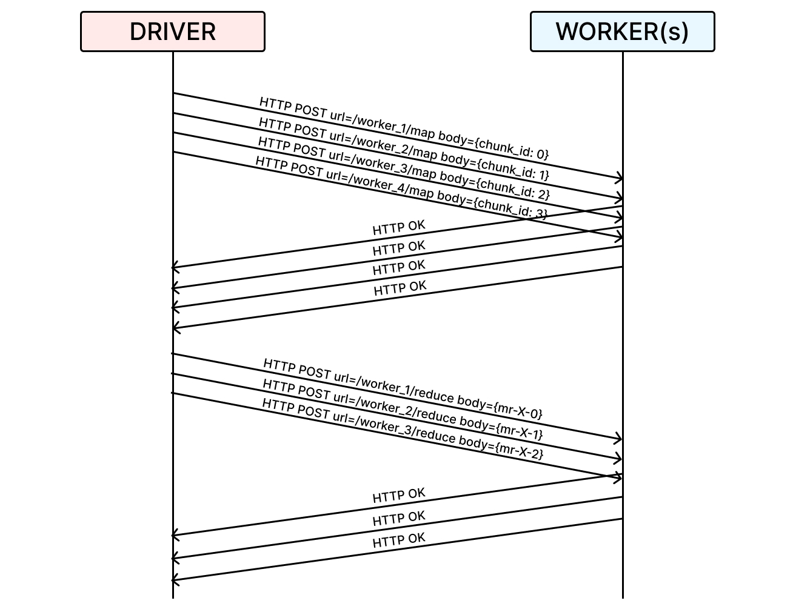

# py-mapreduce

A lightweight MapReduce micro-framework for word counting, implemented in Python.

## Installation

1. Clone this repository and navigate to the root of the project:

```bash
git clone https://github.com/ggcr/py-mapreduce.git
cd py-mapreduce
```

2. Create an environment and install dependencies:

```bash
conda create -n pymapreduce python=3.10 -y
conda activate pymapreduce
pip install requests
```

## Usage

There are two ways to run the framework:

### Method 1: Initialize workers separately

1. In one terminal window, start the workers:

```bash
python3 -m src.http_worker -N 30 -M 30
```

2. In another terminal window, start the driver:

```bash
python3 -m src.main -N 30 -M 30 inputs/*.txt
```

### Method 2: Let the driver start the workers

Simply run the driver, which will start the workers automatically:

```bash
python3 -m src.main -N 30 -M 30 inputs/*.txt
```

> [!NOTE]
> The framework will create a maximum of `max(N, M)` workers. These workers are reused for both map and reduce tasks, optimizing resource usage.
>
> For example, if N=30 and M=20, a total of 30 workers will be created and reused for both phases of the MapReduce process.

## Project Structure

Due to the constraint of only being able to send metadata between the driver and workers, the framework splits input files into N chunks and stores them in an intermediate directory at `files/chunks/`. This approach allows for the distribution of work across workers while mantaining the requirement of metadata-only transfer.

```
├── files
│   ├── chunks
│   │   ├── chunk_0.pkl
│   │   ├── ...
│   │   └── chunk_N.pkl
│   ├── intermediate
│   │   ├── mr-0-1
│   │   ├── ...
│   │   └── mr-N-M
│   └── out
│       ├── out-0
│       ├── ...
│       └── out-M
├── inputs
│   ├── pg-being_ernest.txt
│   ├── pg-dorian_gray.txt
│   └── ....
└── src
    ├── driver.py
    ├── http_worker.py
    ├── main.py
    ├── utils.py
    └── worker.py
```


## Communication Protocol

The framework uses a simple HTTP-based communication protocol between the driver and workers. Here's an example sequence for N=4 and M=3:



## Recursive dynamic creation of HTTP Workers

One nice feature of this framework is the ability to dynamically create workers when needed. This is particularly useful when a worker is not responding or has not been started. Here's how it works:

```python
def map_worker(self, n: int, chunk_path: str, retries: int = 0) -> None:
    try:
        payload = {
            'n': n, 'M': self.M, 'chunk': chunk_path,
            'BUCKETS_PARENT_PATH': self.BUCKETS_PARENT_PATH,
        }
        response = requests.post(url=f"{self.WORKERS_URL}:{8000 + n + 1}/map", json=payload)
        response.raise_for_status() # checks that res.status_code == 200 (OK)
    except requests.exceptions.ConnectionError:
        print(f"[DRIVER] HTTP Worker {self.WORKERS_URL}:{8000 + n + 1} is not up. Attempting retry {retries + 1}")
        process = subprocess.Popen([sys.executable, '-m', 'src.http_worker', '-id', str(n + 1)])
        if retries < 5:
            time.sleep(1)
            self.map_worker(n, chunk_path, retries + 1) # recursive
```

This method attempts to send a map task to a worker. If the worker is not responding (`ConnectionError`), the driver will:

1. Log the failure and retry attempt.
2. Spawn a new worker process using `subprocess.Popen`.
3. Wait for 1 second to allow the worker to start up.
4. Retry the map task, up to a maximum of 5 attempts.

This approach ensures that the framework can recover from worker failures or missing workers, making it more robust and easier to use. Users don't need to worry about starting all workers manually - the system will create them as needed.

For more details on the implementation, please refer to the source code in the `src` directory.