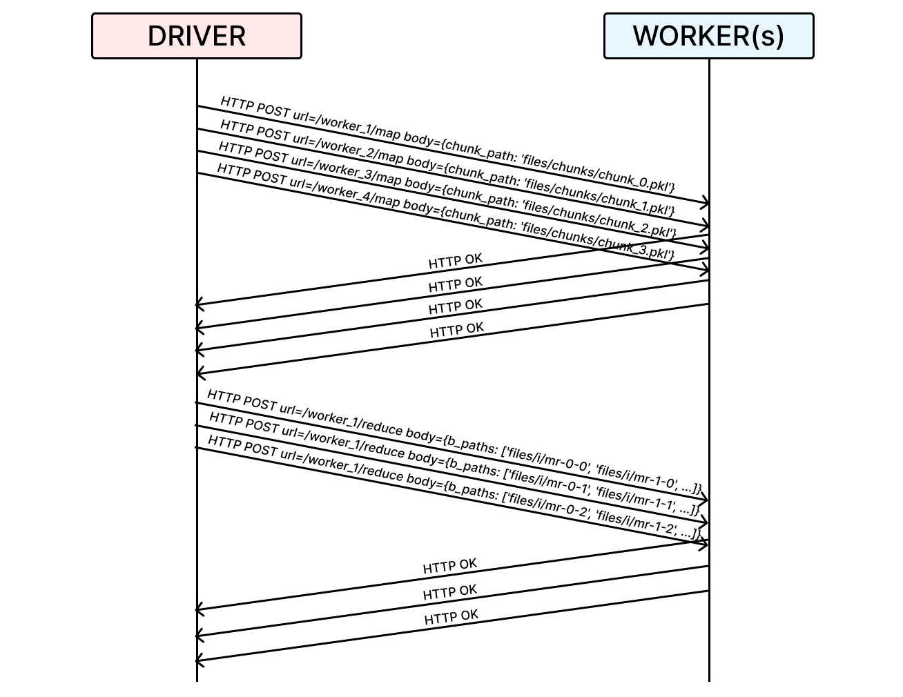

# py-mapreduce

A lightweight MapReduce micro-framework for word counting, implemented in Python.

## Installation

1. Clone this repository and navigate to the root of the project:

```bash
git clone https://github.com/ggcr/py-mapreduce.git
cd py-mapreduce
```

2. Create an environment and install dependencies:

```bash
conda create -n pymapreduce python=3.10 -y
conda activate pymapreduce
pip install --upgrade pip  # enable PEP 660 support
pip install requests
```

## Usage

There are two ways to run the framework:

### Method 1: Initialize workers separately

1. In one terminal window, start the workers:

```bash
python3 -m src.http_worker -N 30 -M 30
```

2. In another terminal window, start the driver:

```bash
python3 -m src.main -N 30 -M 30 inputs/*.txt
```

### Method 2: Let the driver start the workers

Simply run the driver, which will start the workers automatically:

```bash
python3 -m src.main -N 30 -M 30 inputs/*.txt
```

## Project Structure

```
├── files
│   ├── chunks
│   │   ├── chunk_0.pkl
│   │   ├── chunk_N.pkl
│   ├── intermediate
│   │   ├── mr-0-1
│   │   ├── mr-0-1
│   │   └── mr-N-M
│   └── out
│       ├── out-0
│       └── out-M
├── inputs
│   ├── pg-being_ernest.txt
│   ├── pg-dorian_gray.txt
│   └── ....
└── src
    ├── driver.py
    ├── http_worker.py
    ├── main.py
    ├── utils.py
    └── worker.py
```

## Communication Protocol

The framework uses a simple HTTP-based communication protocol between the driver and workers. Here's an example sequence for N=4 and M=3:



For more details on the implementation, please refer to the source code in the `src` directory.